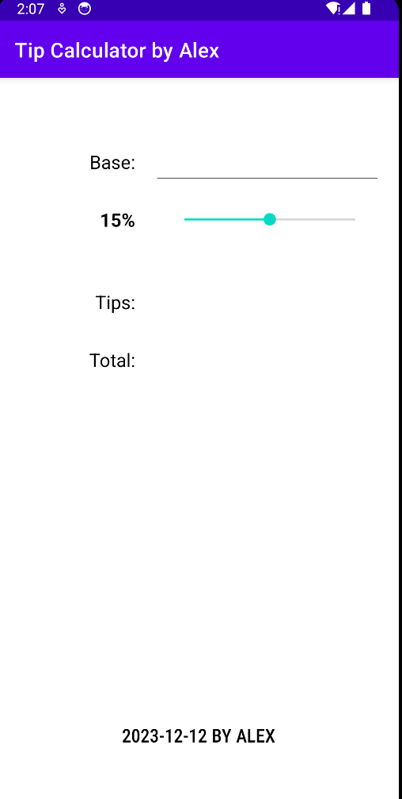
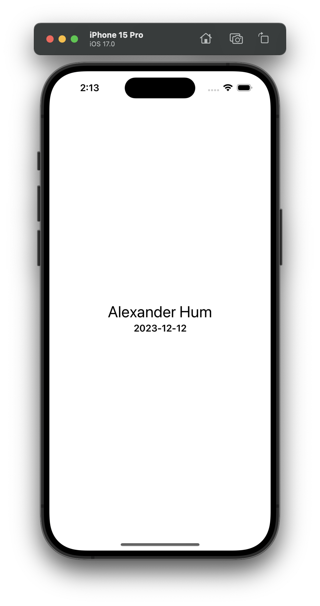
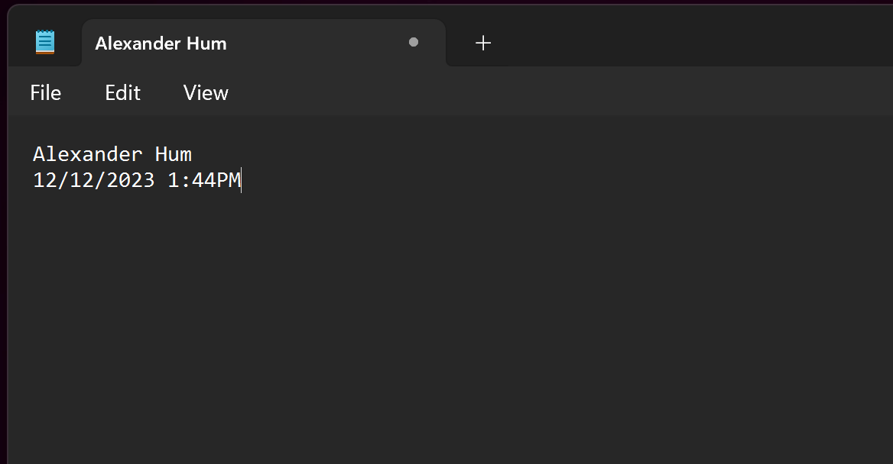

# Alexander Hum FinalProject

Step 1:

```JS
function getDaysUntilChristmas() {
  const today = new Date()
  let todayDate = today.getDate()
  let todayMonth = today.getUTCMonth() + 1
  const christmas = new Date('2023-12-25')
  let christmasDate = christmas.getDate() + 1
  let christmasMonth = christmas.getMonth() + 1
  let daysUntilChristmas = christmasDate - todayDate
  console.log(`There are ${daysUntilChristmas} days until Christmas.`)
}
getDaysUntilChristmas()
```

Step 2: Android Studio


Step 3:


Step 4: Notepad

